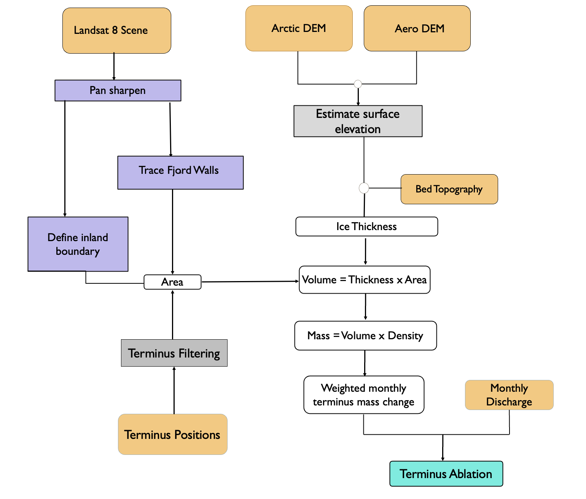
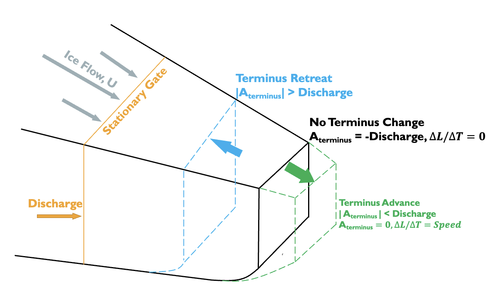

## Terminus ablation calculation and analysis

For queries, email: [amankc@u.boisestate.edu](mailto:amankc@u.boisestate.edu)

The datasets and methodologies used to construct the terminus ablation time series are illustrated in Fig. 1.\

Figure 1. Flowchart describing the methodology used to calculate terminus ablation. Rounded rectangles show inputs, intermediate outputs,
and final output. Angular gray rectangles show the mathematical processes and purple rectangles show the processes applied to satellite
images. Orange rectangles show data from external sources

Figure 2: Schematic sketch showing glacier terminus ablation. Schematic sketch showing glacier terminus ablation. The green terminus
position shows glacier advance, blue shows glacier retreat and solid black shows no change in terminus. Solid orange line shows a stationary
gate used to calculate ice discharge. Here, ∆M/∆t is change in terminus over time, A_terminus is Terminus Ablation and U is the velocity.
