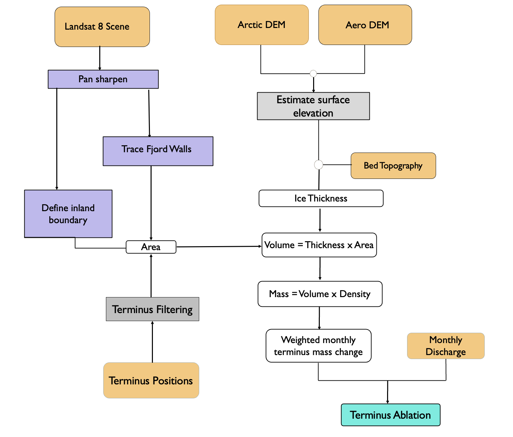
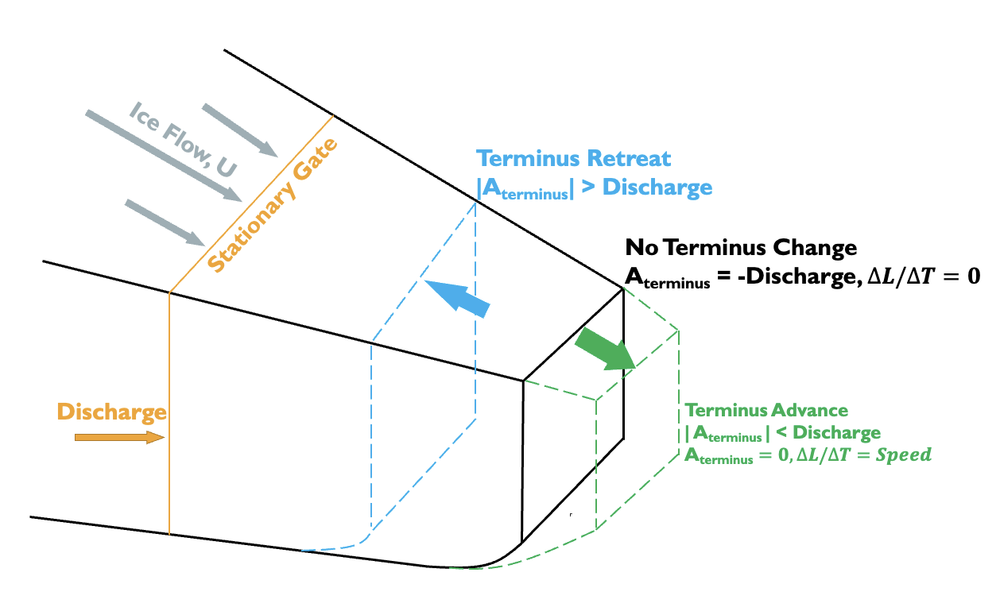
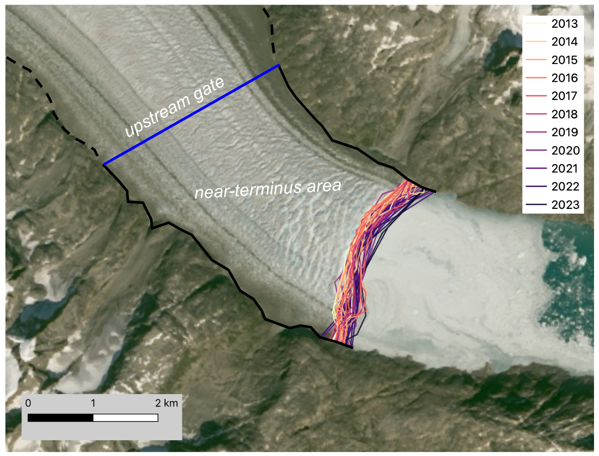
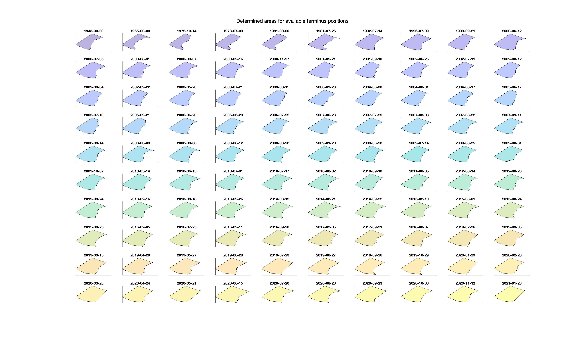
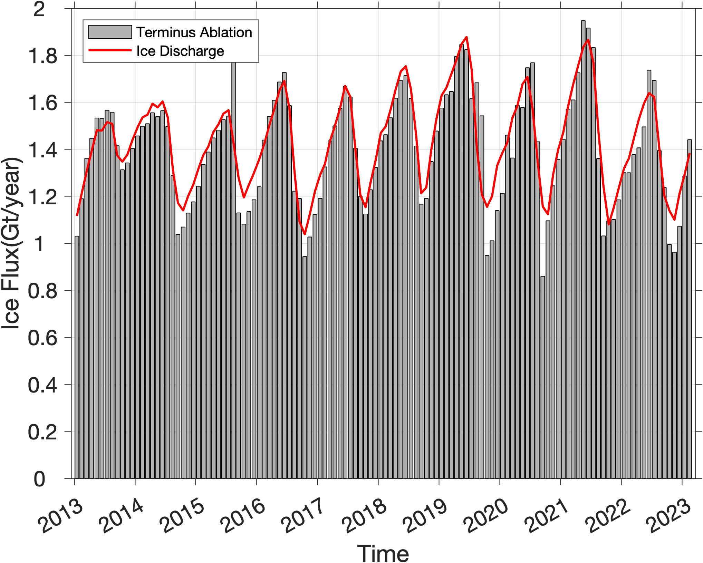

## Terminus ablation calculation and analysis
##still in progress!!
For queries, email: [amankc@u.boisestate.edu](mailto:amankc@u.boisestate.edu)

The datasets and methodologies used to construct the terminus ablation time series are illustrated in Fig. 1.\

Figure 1. Flowchart describing the methodology used to calculate terminus ablation. Rounded rectangles show inputs, intermediate outputs,
and final output. Angular gray rectangles show the mathematical processes and purple rectangles show the processes applied to satellite
images. Orange rectangles show data from external sources

Figure 2: Schematic sketch showing glacier terminus ablation. Schematic sketch showing glacier terminus ablation. The green terminus
position shows glacier advance, blue shows glacier retreat and solid black shows no change in terminus. Solid orange line shows a stationary
gate used to calculate ice discharge. Here, ∆M/∆t is change in terminus over time, A_terminus is Terminus Ablation and U is the velocity.

# Running the code

MATLAB files can be used to generate monthly terminus ablation time series and python notebooks are mostly for analysis of the time series and regional comparison. 

Note about the time series: If there are multiple terminus traces in a single month (mostly during summer months), the terminus ablation is weighted. However, in case of no data, linear interpolation is used to fill the data gap based on two near-month observations.

Matlab sections are numbered. Some of the sections are marked optional. You can run that, depending on the data you are importing or if you want to plot additional figures.

1. Import all the terminus traces, and add any additional traces you have.
2. Filter the trace to avoid any duplication.
3. Read all the DEMs and landsat images.
4. Read the fjord boundaries. If not, it will prompt you to draw one based on the Landsat image you imported on step 3.
   
    Figure 3: Example drawing of fjord boundaries
6. Get closest point on Fjordwall to end/startpoint of Terminus Position
7. Check where Margin Endposition is located in relation to upper fjord wall boundary. This step extrapolates terminus position endpoint to upper fjord wall boundary if it doesn't intersect with the fjord wall or crops it to the point of intersection.
8. Check Extrapolation
9. Check if terminus position intersects fjord walls more than once.
10. Check if length of extrapolation exceeds actual terminus delineation
11. Define Boundary upstream of last Terminus Position. If upstream boundary is already in the directory, it will just run the code. If not, it will prompt you to draw one. Make sure you draw upstream of the most retreated position of the glacier.
12. This is the step that asks if the user wants to change the upstream boundary. You can change it by providing the translation numbers in x and y direction.
13. Crop the fjord wall boundaries to the specific terminus boundaries.
14. This is the step to filter terminus traces based on averaged NASA ITS_LIVE velocities. The first step will create equally spaced points based on the centerline loaded, then will find the closest centerrline point to each terminus trace. It will then come with a velocity based on two closest date, and flag out the terminus which are exceeding two times the averaged velocity.
15. Sometimes the terminus traces might not get detected by the centerline. It repeats step 12 based on midpoint of terminus trace.
16. Clearing the length that are longer than 1.5 or 0.5 times the mean of all the termini for shapes that go undetected in the previous steps.
17. This step exports the filtered termini into a shapefile.
18. Concatenate Boundaries, create polygon and calculate area.
    
    Figure 4: Example plot for Heimdal

20. Calculate the volume using thickness from BedMachine thickness estimates, and then outputs a table containing dates, area, volume, thickness, and mass.
21. This step crates a dummy matrix to store the monthly terminus ablation and discharge values.
22. Calculation of Terminus Ablation: If there are multiple terminus traces in a single month (mostly during summer months), the terminus ablation is weighted. However, in case of no data, linear interpolation is used to fill the data gap based on two near-month observations.
    
    Figure 5: Example plot of terminus ablation and discharge for Heimdal
    
19a. (Optional): Sometimes a glacier can be fed through multiple gates. So if that's the case, run this section.
24. It finds the index of points which have negative terminus ablation which is not possible.
25. It grabs the corresponding error from dicharge data.
26. This step uses the standard error propagation technique to calculate the area and accumulate through near-terminus mass.
27. (Optional): Calculation of average mass rates.
